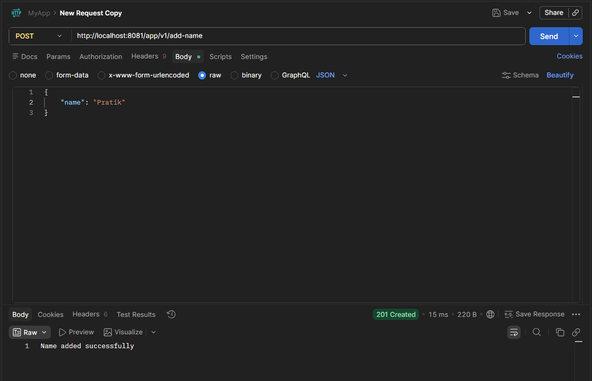

## Spring Boot App

### Spring Boot Flow Diagram

> MyFirstController → MyFirstService → MyFirstRepository(Not Used Yet) → Database(Not Used Yet)

- The real data has been stored inside the MyConstant class.

### GET Endpoint

- http://localhost:8081/app/v1/get-name

~~~ curl
curl --location 'localhost:8081/app/v1/get-name'
~~~
- Response:
~~~ json
{
  "data": {
    "808b34b4-23e3-4a09-a1e7-207c194346ad": "Sima",
    "82548a06-eb93-4671-95a4-e1fa2309667e": "Pratik"
  },
  "message": "Names retrieved successfully"
}
~~~

### POST Endpoint
- http://localhost:8081/app/v1/add-name
- Body:

~~~ json
{
    "name": "Sima"
}
~~~

~~~ curl
curl --location 'http://localhost:8081/app/v1/add-name' \
--header 'Content-Type: application/json' \
--data '{
    "name": "Sima"
}'
~~~

### Build and Deploy :
- Build the project using Maven.

~~~ bash
mvn clean install
~~~
- Once Build Success.
- Yuu could see the deployment jar available in the target folder `/app-base-path/target/peer-prog-0.0.1-dev.jar`.
- Run the jar file, this is the deployment file and also called the `production ready` file.
- This is a Spring Boot application, so you can run the jar file using the below command.

~~~ bash
java -jar peer-prog-0.0.1-dev.jar
~~~
- It runs with the default port provided by the application (inside the `application.yaml`).
- incase you need to change the port, then **EITHER** you can change it inside the `application.yaml` file **OR** 
   provide the port number as a command line argument while running the jar file.
- For example, to run the application on port 8082, you can use the following command:

~~~ bash
java -jar peer-prog-0.0.1-dev.jar server.port=8082
~~~
- This is going to override the default port provided in the `application.yaml` file and run the application on port 8082.

